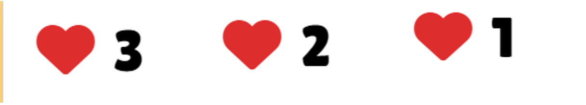

# Welcome to "Guess the Word - Kids Edition"! 🌈🔍

## Introduction

Embark on a delightful journey of learning and fun with our interactive word-guessing game specially designed for kids. In this engaging experience, children have the exciting opportunity to choose from a variety of categories including Colors, Shapes, Fruits, Vegetables, Numbers, and Weather. Tailored for young minds, our game offers an enjoyable way for kids to enhance their vocabulary and cognitive skills.


## How to Play

- **Category Selection:** Start your journey by selecting a category that sparks your interest - Colors, Shapes, Fruits, Vegetables, Numbers and Weather!

- **Word Guessing:** Once you've chosen a category, the game reveals a word for you to guess. Click on letters from the game board to uncover the hidden word.

- **Hints and Exploration:** Utilize hints to get clues about the word. Explore different categories or stick with your favorite throughout the game.

- **Chances:** Keep an eye on your chances! You have a limited number of attempts to guess the word. Use them wisely.

- **Victory or Defeat:** Successfully guess all the letters before running out of chances, and you'll be greeted with a cheerful "You Win!" message. If challenges arise, face them with grace, and the game will acknowledge your efforts with a comforting "You Lose!" message.

- **Next Word Challenge:** Move on to the next word in the same category only after you've successfully guessed the current one. It adds more excitement and challenge, making you solve each mystery before unlocking the next fun puzzle!

Get ready for a super fun learning adventure, where every guess brings you closer to victory in the magical world of words! 🌈🔍🚀

## Benefits
"Guess the Word - Kids Edition" is more than just a game; it's an educational tool designed to foster learning in an entertaining manner. Here's how it helps improve various skills:

- **Vocabulary Building:**
Children encounter a diverse range of words associated with Colors, Shapes, Fruits, Vegetables, Numbers, and Weather, expanding their vocabulary in a playful setting.

- **Cognitive Development:**
The game challenges kids to think critically, make connections between words and categories, and sharpen their cognitive abilities.

- **Category Recognition:**
Enhances kids' ability to categorize different objects and concepts, fostering a better understanding of the world around them.

- **Interactive Learning:**
The interactive nature of the game makes learning enjoyable, encouraging kids to actively participate and absorb information effortlessly.

- **Flexibility and Exploration:**
Kids have the freedom to explore various categories, promoting curiosity and a well-rounded understanding of different subjects.

"Guess the Word - Kids Edition" is not just a game; it's a playful educational experience that combines entertainment with learning. Join us on this exciting adventure where every guess brings your child one step closer to a world of knowledge and discovery! 🚀📚

## UX and UI
### Project and Customer Goals:
The primary objective of this project is to provide an engaging and intuitive user experience for players of the Word Guessing Game. The following goals guide my design decisions:

### Business Goal:
**Entertainment and Education:** Deliver a game that entertains users while enhancing their vocabulary and word recognition skills.

### User Stories:
- As a player, I want an easy and enjoyable way to guess words in different categories.
- As a learner, I want hints and clues to help me understand and guess the words.
- As a user, I want a visually appealing and responsive interface to enhance my overall experience.

### Features:
1. **How to Play Guide:** Enhance the user experience by incorporating a detailed "How to Play" guide directly on the home page. This feature provides users with step-by-step instructions, ensuring they understand the gameplay and making it easy for both new and experienced players to dive into the game.


2. **Category Selection:** Allow users to choose from a variety of categories, including Colors, Shapes, Fruits, Vegetables, Numbers and  Weather.


3. **Word Guessing:** Present users with hidden words for an interactive and challenging gaming experience.


4. **Hints and Exploration:** Provide helpful hints to assist users in uncovering the words.


5. **Chances System:** Implement a system to track the number of attempts users have to guess the word.


6. **SweetAlert Notifications:** Enhance the user experience with visually appealing pop-up notifications using SweetAlert for certain in-game events.


7. **Category Change:** Enable users to change the category at any time, providing flexibility and variety in gameplay.

8. **Next Word Challenge:** Move to the next word in the same category only after successfully guessing the current one. This feature makes the game more exciting by asking players to improve their word detective skills. Conquer each mystery before unlocking the next fun puzzle, adding extra excitement and challenge to the game.


9.**Toggleable Background Music:** Empower users to play or pause the background music at any time with a simple toggle button, allowing them to control the auditory experience and enjoy a customizable gaming environment.


### Future Features:

As I continue to enhance the Word Guessing Game, here are some exciting features I am considering for the future:

- **Credits System:** Implement a credits system that users can earn or spend within the game, unlocking bonus hints, themes, or other exciting rewards.

- **Timer Challenge:** Introduce a timed mode for an added challenge, allowing users to test their word-guessing skills against the clock.

- **Leaderboard:** Introduce a competitive element by showcasing high scores, adding a fun and engaging challenge for players.

### Information Structure:

The information in the game is organized to create a smooth and logical flow for users:

- **How to Play Guide:** Clear instructions on gameplay presented in the welcome page, helping users understand the rules and objectives.

- **Category Selection:** Clear buttons for selecting categories, making it easy for users to choose their preferred word category.

- **Word Display:** An area to display the hidden word with visual cues, showing a row of dashes representing each letter of the word.

- **Hint Area:** A designated space to provide clues or hints for the word, helping users in their guessing journey. 

- **Game Board:** Interactive buttons for guessing letters, allowing users to engage actively in the guessing process. SweetAlert notifications will provide feedback on successful guesses, incorrect letters, and when there are no more words in the category.

- **Chances Display:** A visually appealing display to indicate remaining chances, keeping users informed about their progress and encouraging strategic thinking. SweetAlert notifications can alert users when they run out of chances and provide encouragement to try again.


### Presentation:
- Vibrant Colors: Use a palette that is visually engaging and complements the theme of the game.
- Animated Text: Utilize animated text to capture attention and add a dynamic element.

### Look and Feel:
- User-Friendly: Prioritize an interface that is easy to navigate and understand.
- Engaging Graphics: Incorporate visually appealing elements to enhance the gaming experience.
- Responsive Design: Ensure the game adapts seamlessly to different screen sizes.

### Technologies Used:
- HTML5: Structuring the content and layout.
- CSS3: Styling and presentation of the game interface.
- JavaScript: Implementing interactive elements and game logic.
- Bootstrap 5: Enhancing responsiveness and styling.
- SweetAlert2: Displaying attractive pop-up messages.
- Font Awesome: Integrating icons for a visually pleasing UI.

## Wireframes
- **Desktop:**

- **Tablet:**

- **Phone:**


## How to Install and Run the Project

### Installation

1. Clone the repository to your local machine:

    ```bash
    git clone https://github.com/SABA-SALEH/guess-the-word.git
    ```

2. Navigate to the project directory:

    ```bash
    cd guess-the-word
    ```

3. Install project dependencies:

    ```bash
    npm install
    ```

### Run the Game

Execute the following command to start the game:

```bash
npm start
 ```
Open your web browser and go to http://localhost:8000 to play the Guess the Word - Kids Edition Game.


   

## Deployment

This Guess the Word - Kids Edition Game project was developed using the Gitpod IDE, committed to Git, and pushed to GitHub.

### Deploying to GitHub Pages

To deploy this game to GitHub Pages from its GitHub repository, follow these steps:

1. Log into GitHub.
2. From the list of repositories on the screen, select `SABA-SALEH/guess-the-word`.
3. From the menu items near the top of the page, select Settings.
4. Scroll down to the GitHub Pages section.
5. Under Source, click the drop-down menu labeled None and select the Branch you want to deploy (e.g., main or master).
6. After selecting the Branch, the page is automatically refreshed, and the website is now deployed.
7. Scroll back down to the GitHub Pages section to retrieve the link to the deployed website.

**Note:** Ensure that the selected branch contains the latest version of your game.

### How to Run This Project Locally

#### Cloning the Project from GitHub to Gitpod

To clone this project from GitHub to Gitpod:

1. Open your Gitpod IDE.
2. Create a new workspace or open an existing one.
3. In the terminal, type `git clone https://github.com/SABA-SALEH/guess-the-word.git`.
4. Press Enter. Your Gitpod workspace is now set up with the project code.

#### Running Locally in Gitpod

Once the project is cloned, navigate to the project directory.

1. Open the ` index.html` file in the IDE.
2. Right-click on the file and choose "Open Preview" to view the project locally in Gitpod.

#### Running Locally in a Local IDE (Optional)

To run this project in a local IDE like Visual Studio Code, PyCharm, etc.:

1. Follow this link to the Project GitHub repository: [Guess The Word GitHub Repository](https://github.com/SABA-SALEH/guess-the-word).
2. Under the repository name, click Code.
3. In the "Clone with HTTPS" section, copy the clone URL for the repository.
4. In your local IDE, open the terminal.
5. Change the current working directory to the location where you want the cloned directory to be made.
6. Type `git clone`, and then paste the URL you copied in Step 3.


## Testing

### Manual Testing

#### Home Page:
- Check if the "Play" button works and redirects to the category page.

#### Category Page:
- Test all category buttons to ensure they work correctly.
- Verify that clicking on a category button redirects to the Guess the Word page with the chosen category.
- Check if the "Back Home" button works correctly, redirecting to the home page.

#### Guess the Word Page:
-  Confirm that the game starts with the chosen category.
-  Check if the word is displayed in dashes, and the related hint is shown correctly.
-  Ensure the game board loads correctly.
-  Test if the user can click correct buttons to guess letters in the word.
-  Verify that a letter can only be clicked once.
-  Check if the "Home" button works correctly, redirecting to the home page.
- The game selects a word and displays the letters in the word as dashes.
  - User interface includes a game board with all letters in the English alphabet.
  - User guesses a letter by clicking on a letter in the game board.
  - If the guessed letter is correct, update the dashes in the word.
  - Once all letters are guessed, confirm that all letters are disabled, and the "Next Word" button is enabled.
  - User wins if they guess all letters in the word, and a "You Win!" message is displayed.
  - If the user selects an incorrect letter, display an alert and reduce chances.
  - When the user runs out of chances, display the word and a "You Lose!" message.
  - Move to the next word within the same category after successfully guessing the current one.
  - Display an inspiring message when finishing all words in the category.
  - Allow the user to change the category at any time.

### Navigation
-  Test navigation across different pages to ensure a smooth user experience.

### Automated Testing

#### Code Validation

- **HTML Validator:**
  Validate HTML code to ensure it adheres to the defined standards and correct any markup errors.
  
  
  

- **CSS Validator:**
  Use a CSS validator to check the stylesheets for compliance with CSS standards and identify and fix any issues.
  The errors and warnings are originating from Bootstrap 5.
  

- **JS Validator:**
  Validate JavaScript code to catch errors, ensure syntax correctness, and maintain code quality.
  

- **Lighthouse Audit:** 
  Chrome DevTools Lighthouse was employed to assess performance, best practices, accessibility, and SEO, resulting in optimizations.
  
  
  


#### Console Checking

- **Console Logging:**
  Regularly check the browser console for any error messages, warnings, or informational logs during development and testing.
  

### Client Stories Testing

**Client Story 1:**

 - As a user, I want to enjoy an interactive and challenging game.
    - Verify that the game interface is engaging and provides a challenging experience.
    - Check if the game responds promptly to user interactions.
    - Ensure that the game flow is intuitive and easy to understand.

**Client Story 2:**

 - As a user, I want to receive helpful hints to uncover hidden words.
    - Confirm that hints are displayed for each word in the game.
    - Test if hints are relevant and provide assistance in guessing the word.
    - Ensure that hints are accessible and easy to view during the game.

**Client Story 3:**

 - As a user, I want the game to provide feedback on my performance.
    - Check if the game provides feedback messages for correct and incorrect guesses.
    - Verify that the feedback messages are clear and informative.
    - Test if there is feedback on winning or losing the game.
    - Confirm that the game communicates the remaining chances to the user.

**Client Story 4:**

 - As a user, I want the option to change the game category.
    - Test the functionality to change the game category at any point.
    - Confirm that changing the category resets the game appropriately.
    - Ensure the user is informed about the category change.

**Client Story 5:**

 - As a user, I want a seamless transition between words in the same category.
    - Test if moving to the next word within the same category works smoothly.
    - Confirm that the game resets appropriately for the next word.
    - Ensure the user experience is consistent across different words in the same category.

**Client Story 6:**

-  As a user, I want the ability to return to the home page easily.
    -  Test the functionality of the "Home" button.
    -  Verify that clicking the "Home" button redirects to the home page.
    -  Confirm that the game state is reset when returning to the home page.

## Bugs and Fixes
### Issue 1: Preserving Category Value
**Bug:** When starting a new game or moving to the next word, the category value is not preserved.

**Fix:** To address this issue, the `localStorage` is used to store and retrieve the current category. When starting a game or moving to the next word, the category is stored in `localStorage` and fetched when needed.

``` javascript
function redirectToCategoryPage() {
    const currentCategory = localStorage.getItem('category');
    localStorage.setItem(`${currentCategory}_wordIndex`, 0);
    window.location.href = 'category.html';
}
```

### Issue 2: Avoiding Word Repetition
**Bug:** Words can be repeated when the user plays the game, leading to a less challenging experience.

**Fix:** The code now keeps track of the word index for each category in `localStorage`. It ensures that a word is not repeated until all words in the category have been used. If there are no more words in the category, the user is notified, ensuring a diverse and engaging gameplay experience.

```javascript
function getWord(category) {
    const wordsByCategory = {
        // ... (Words for different categories remain unchanged)
    };

    if (category && wordsByCategory.hasOwnProperty(category)) {
        const words = wordsByCategory[category];

        if (words && words.length > 0) {
            let wordIndex = parseInt(localStorage.getItem(`${category}_wordIndex`) || 0);

            if (wordIndex < words.length) {
                const selectedWord = words[wordIndex];
                localStorage.setItem(`${category}_wordIndex`, wordIndex + 1);

                return selectedWord;
            } else {
                console.log('No more words in the category.');
                return null;
            }
        } else {
            console.error('Category has no words.');
        }
    }

    return null;
}

```
### Issue 3: Improved Alert Display
**Bug:** The alert messages were basic and needed improvement for a better user experience.

**Fix:** The code now utilizes the SweetAlert2 library to display more visually appealing and informative alerts. Different icons and styles are used for success, warning, and error messages, providing a more engaging and user-friendly interface.

```javascript
Swal.fire({
                    icon: 'error',
                    title: 'Oops, You Lose!',
                    text: `Don't worry, you'll get it next time! The word was: ${secretWord}. Keep trying and have fun!`,
                    confirmButtonText: 'OK'
                }).then(() => {
                   
                   window.location.href = 'index.html';
                });
```

### Issue 4: Replacing Dashes with Chosen Letters
**Bug:** The challenge was to replace the dashes in the displayed word with the letters chosen by the user during the game.

**Fix:** The code has been modified to dynamically replace the dashes in the displayed word with the correct letters chosen by the user. 

```javascript
function updateWordDisplay(selectedWord, selectedLetter) {
    const wordContainer = document.getElementById('word');
    if (wordContainer) {
        const wordArray = selectedWord.split('');
        let updatedWord = wordContainer.textContent.split(' ');

        let isLetterCorrect = false;

        for (let i = 0; i < wordArray.length; i++) {
            if (wordArray[i] === selectedLetter) {
                updatedWord[i] = selectedLetter;
                isLetterCorrect = true;
            }
        }
        const displayWord = updatedWord.join(' ');
        wordContainer.textContent = displayWord;

        // ... (Rest of the code)
    }
}

```

### Issue 5: Creating the Game Board
**Bug:** The initial implementation lacked a dynamically created game board, affecting the overall interactivity of the game.

**Fix:** The code now dynamically generates the game board, consisting of letter buttons representing the alphabet.

```javascript
function setupGameBoard() {
    const gameBoardContainer = document.getElementById('game-board');
    if (gameBoardContainer) {
        const alphabet = 'ABCDEFGHIJKLMNOPQRSTUVWXYZ';
        const alphabetArray = alphabet.split('');

        alphabetArray.forEach(letter => {
            const letterButton = document.createElement('button');
            letterButton.textContent = letter;
            letterButton.addEventListener('click', () => {
                handleLetterClick(letter);
            });
            gameBoardContainer.appendChild(letterButton);
        });
    }
}

```

## Credits
- Project developed by SABA SALEH

- [Color Picker](https://redketchup.io/color-picker): Used for selecting and managing colors in the project.

- [SweetAlert2](https://sweetalert2.github.io/): Utilized for displaying beautiful and customizable pop-up alerts.

- English Letters Background: Background image source available at [FreePik](https://www.freepik.com/free-photos-vectors/english-letters-background).

- [Image Optimizer](http://www.imageoptimizer.net/Pages/Home.aspx): Used for optimizing and compressing images in the project.

- [Favicon.cc](https://www.favicon.cc/?action=icon&file_id=816538): Source of the favicon used in the project.

- [Bootstrap](https://getbootstrap.com/): Framework for building responsive and visually appealing web pages.

- [Font Awesome](https://fontawesome.com/): Icon toolkit used for adding scalable icons to the project.

- Background Music: [Chosic](https://www.chosic.com/download-audio/58131/): Source of the background music used in the project.

## Contributing
If you have ideas for improvements or new features, I welcome contributions. Fork the repository, make your changes, and submit a pull request. Let's make the game even more exciting together!
